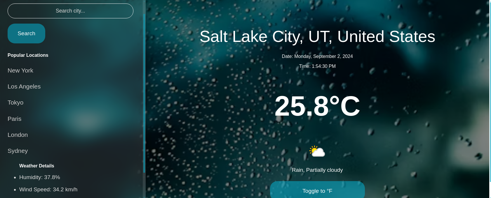

# 🌦️ Weather App

## Overview

The **Weather App** is a dynamic and visually compelling web application that provides real-time weather information for locations across the globe. The app offers an updated user interface with a unique design, custom scrollbars, and seamless responsiveness. Users can easily switch between Celsius and Fahrenheit, explore popular cities, and see detailed weather metrics like humidity, wind speed, and atmospheric pressure—all while enjoying a fresh and modern UI.

## Key Features

- **Real-Time Weather Data**: Instantly fetch and display weather conditions for any location worldwide.
- **Dynamic Date and Time**: Automatically updates the local date and time based on the selected location’s timezone.
- **Custom Weather Icons**: Uses WeatherAPI to display weather conditions with beautifully styled icons.
- **Unit Toggle**: Switch between Celsius and Fahrenheit with a single click.
- **Popular Locations**: Quickly access weather data for major cities like New York, Los Angeles, Tokyo, Paris, London, and Sydney.
- **Responsive Design**: Ensures a seamless experience across all devices, with a mobile-friendly interface.
- **Custom Scrollbar**: A uniquely styled scrollbar that matches the app’s overall aesthetic.

## Technologies Used

- **JavaScript (ES6+)**
- **Webpack**
- **CSS3 with Custom Styling**
- **Axios for API Requests**
- **WeatherAPI and Visual Crossing Weather API**

## Installation and Setup

### Prerequisites

- **Node.js** and **npm** installed on your machine.

### Installation

1. **Clone the repository**:

    ```bash
    git clone https://github.com/your-username/weather-app.git
    cd weather-app
    ```

2. **Install dependencies**:

    ```bash
    npm install
    ```

3. **Set up API keys**:

    Create a `.env` file in the root of your project and add your API keys:

    ```bash
    VISUAL_CROSSING_API_KEY=your_visual_crossing_api_key
    WEATHER_API_KEY=your_weather_api_key
    ```

4. **Run the development server**:

    ```bash
    npm run start
    ```

    Your app will now be running on `http://localhost:8080`.

5. **Build for production**:

    ```bash
    npm run build
    ```

    This will generate optimized files in the `dist` directory, ready for deployment.

## Usage

- **Search for a location**: Enter the name of a city in the search bar and click "Search" to view the current weather conditions.
- **Switch units**: Use the "Toggle" button to switch between Celsius and Fahrenheit.
- **Explore popular locations**: Click on any of the default cities listed in the panel to instantly view their weather.
- **Experience Custom Design**: Enjoy the modern UI with custom-styled scrollbars and responsive layout.

## Screenshots




[**Explore the live project here!**](https://your-project-link.com)


## Acknowledgments

- **WeatherAPI**: For providing the weather data and icons.
- **Visual Crossing**: For accurate and reliable weather data.
- **Unsplash**: For the beautiful background images used in the app.
- **Open Source Community**: For the tools and resources that made this project possible.
